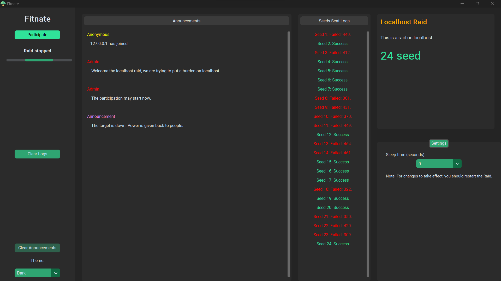

# Fitnate
<p align="center">
    
</p>

  
The *croud* driven **D**istributed **D**enial of **S**ervice operation.

Developed because of a  concern from a discussion about the current state of power distribution between the classes with the rise of technologies like supercomputers.

This is my humble attempt to balance the scales.



### Architecture
#### Admin
Is the main orchestrator of the operation, he issues commands and targets(not implemented).

#### Contributor Node
A partcipator willingly contributing to the operation with a small amount and harmless number of attacks. This is put in place to assert the necessity of a large number of contributors willing to the success of the operation.

#### Evil Target 
The one people desired to be out of service.


### Source
`./*.py` are the implementation of the *Contributor node*.

`tests/target`
The testing *Evil target*, since no such evil entity exist.

`tesrs/websockets`
An implementation of the *Admin* node.

### Packaging
#### Windows
The **./build.py** is a python script for packging the the app, tested only on *windows*.
To build the app run ``` python build.py ``` the executable is will be at ``` ./dist/Fitnate.exe```

Packaging is done by [PyInstaller](https://pyinstaller.org/en/stable/usage.html)
Check out **customTkinter** packaging docs for full info [here.](https://github.com/TomSchimansky/CustomTkinter/wiki/Packaging)

### Licence
none, yet.
